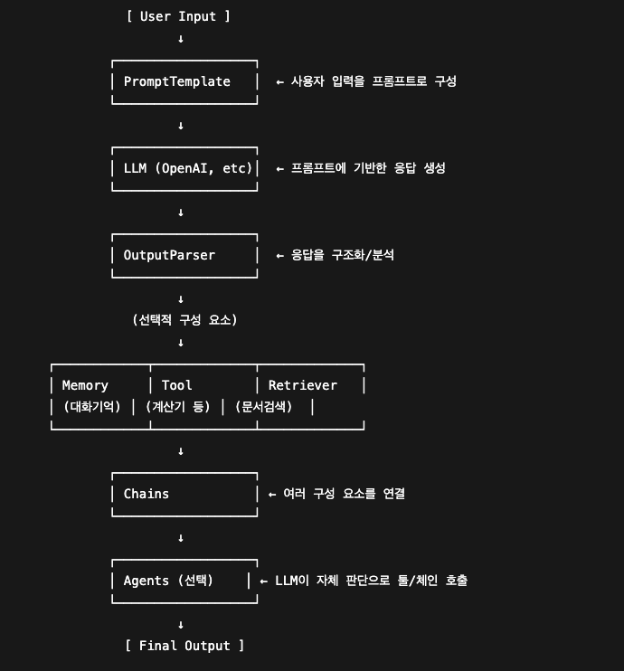

# 🧠 랭그래프 (LangGraph)

## ✅ 랭그래프란?

**랭그래프(LangGraph)** 는 **LangChain 기반**의 프레임워크로,  
복잡한 작업을 **단계별 상태 기반 워크플로우**로 나누고  
조건에 따라 **분기 및 순환** 처리를 쉽게 구현할 수 있도록 도와줍니다.

> 기존 LangChain이 LLM과 도구들을 연결하는 데 중점을 둔다면,  
> **랭그래프는 그래프 기반 흐름 제어**에 초점을 맞춰  
> 더 복잡하고 유연한 프로세스를 설계할 수 있습니다.
> 
> 또한 랭체인은 비순환 그래프 (DAG, Directed Acyclic Graph) 를 사용하여 선형적 워크플로를 생성하지만
랭그래프는 순환을 추가할 수 있어 지속적으로 반복하며 변화하는 조건에 대해 동적인 결정을 할 수 있따.

---

## ✅ 랭체인과 랭그래프의 차이점

| 항목 | LangChain | LangGraph |
|------|-----------|-----------|
| 구조 | 선형 체인 / DAG (비순환) | 상태 기반 그래프 (순환 가능) |
| 초점 | LLM + 도구 연결 | 상태 기반 워크플로우 |
| 유연성 | 정해진 흐름만 가능 | 동적 분기 / 루프 가능 |
| 상태 관리 | 단순 컨텍스트 | 전체 상태 공유 및 업데이트 |
| 활용 | 간단한 체인, 에이전트 | 대화형 에이전트, 문서 자동화 등 |

---

## 핵심 키워드 3가지

작업의 흐름을 정의하는 그래프, 작업 단계를 노드로, 단계 간의 연결을 엣지로 표현한다.

### 💡 `노드 (Node)`  - 일꾼
랭그래프에서의 실행단위를 의미한다. 하나의 작업을 의미하며, 실제 작업을 수행하는 Python 함수를 정의
ex) 검색 , 계산, 응답 생성 등 
---

### 💡 `엣지 (Edge)` - 길, 도로 
노드간의 연결, 실행흐름을 정의하며, 조건부 분기, 루프등도 엣지를 통해 표현 한다.

---

### 💡 `상태 (State)` - 작업 상황판

그래프를 실행하는 동안의 공유되는 컨텍스트, 딕셔너리로 사용되며, 각 노드에서 사용하고 수정 가능하다.

---
## ✅ 랭그래프의 특징

### 💡 1. 상태 기반 그래프 구조
- 작업 흐름을 **노드(Node)** 와 **엣지(Edge)** 로 구성  
- 전체 그래프는 **상태(State)** 를 중심으로 동작

### 💡 2. 핵심 개념
- **상태 그래프 (State Graph)** : 전체 워크플로 구조
- **노드 (Node)** : 실제 작업 단위 함수 (예: 검색, 응답 생성 등)
- **엣지 (Edge)** : 노드 간 연결, 분기 및 루프 표현
- **상태 (State)** : 실행 중 공유되는 컨텍스트 딕셔너리

### 💡 3. 유연한 상태 관리
- 노드 단위로 상태를 읽고/수정 가능  
- 전체가 아닌 **부분 상태 업데이트 (Partial Update)** 지원  
- 상태값에 따라 **다음 흐름을 동적으로 결정** 가능

### 💡 4. 조건부 라우팅
- `conditional_edges` 사용  
- **조건에 따른 다음 노드 선택** 가능 (예: 분기, 오류 처리 등)

### 💡 5. 체크포인팅 기능
- `MemorySaver` 를 이용한 인메모리 체크포인트  
- 중단 복구, 디버깅, 재실행, 실패 지점에서 재시작 지원

---능 최적화, 실패한 지점의 State 부터 재시작 가능.

-----

## 활용 사례
- 잘못된 정보(할루시네이션)가 생성됐을 때 중간 검증 노드로 거절하거나 수정 요청
- 문서에 없는 정보는 웹 검색이나 DB 조회 노드로 연결해 보충
- 대화형 AI, 자동화된 문서 처리, 복잡한 비즈니스 프로세스 자동화 등

활용
 - 사내 컨플루언스 문서를 벡터디비에 저장해서 신규입사자 온보딩등 다양하게 접목해볼 생각임.
 - 사내 전자계약 문서 분석 후 인풋박스 자동 기입

# library RecursiveCharacterTextSplitter

LLM 임베딩 모델은 한 번에 처리할 수 있는 텍스트 길이에 제한이 있어요 (보통 수천 토큰 이하).

긴 문서 전체를 한 번에 벡터화하면 임베딩 품질 저하 또는 오류가 발생할 수 있어요.

쪼개서 저장하면 필요한 부분만 빠르게 검색 가능하고, 더 정확한 유사도 매칭이 가능해집니다.

---------------------------------------------

CharacterTextSplitter VS RecursiveCharacterTextSplitter

CharacterTextSplitter의 경우 단순 문자기준 분할이다 보니 단순구조텍스트에 많이 사용하며
결과가 부자연스러울 수 있음, RecursiveCharacterTextSplitter의 경우 재귀적 방식의 분할을 사용하기 때문에
유연하게 기준에 맞춰서 더 자연스러운 분할 가능 