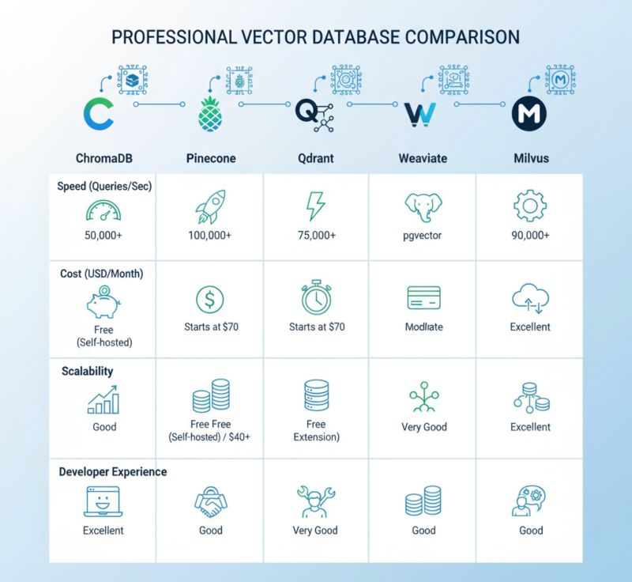

# 12. 벡터 스토어


- 문서를 로드하고 텍스트를 분할한 후 임베딩을 생성해 벡터 데이터를 벡터 스토어에 저장
- 벡터 스토어는 임베딩 벡터를 효과적으로 저장하고 색인화하여 대량의 데이터에서도 관련 정보를 빠르게 검색할수 있게 한다. 
- 확장성, 사용자의 질문과 의미적으로 유사한 단락을 조회할수 있는 의미론적 검색(sematic search)를 지원


## 목차
1. [Chroma](#1-chroma)
2. [FAISS](#2-faiss)
3. [Pinecone](#3-pinecone)
4. [Qdrant](#4-qdrant)
5. [PostgreSQL + pgvector](#5-postgresql--pgvector)
6. [종합 비교표](#6-종합-비교표)


---

## 1. Chroma

### 특징
- **AI 네이티브 오픈소스 벡터 데이터베이스**
- 개발자의 생산성과 편의성에 중점
- Apache 2.0 라이센스
- 로컬 또는 클라우드 배포 가능
- 간단한 Python API 제공

### 장점
✅ **사용 편의성**: 매우 간단한 설치 및 설정  
✅ **오픈소스**: 무료 사용 가능, 커뮤니티 지원  
✅ **로컬 실행**: 데이터 프라이버시 보장  
✅ **LangChain 통합**: 완벽한 LangChain 호환성  
✅ **개발 친화적**: 빠른 프로토타이핑 가능  
✅ **메타데이터 지원**: 풍부한 메타데이터 필터링  

### 단점
❌ **확장성 제한**: 대규모 데이터셋에서 성능 한계  
❌ **고가용성 부족**: 엔터프라이즈급 고가용성 기능 제한  
❌ **분산 처리**: 분산 아키텍처 지원 제한  
❌ **성능 최적화**: 특정 워크로드에서 성능 튜닝 어려움  

### 적합한 사용 사례
- 프로토타입 개발 및 실험
- 중소 규모 애플리케이션
- 로컬 개발 환경
- RAG(Retrieval-Augmented Generation) 시스템

---

## 2. FAISS

### 특징
- **Facebook AI Research에서 개발**
- 밀집 벡터의 효율적인 유사도 검색과 클러스터링
- C++로 구현되어 고성능
- 다양한 인덱스 알고리즘 지원
- CPU/GPU 가속 지원

### 장점
✅ **고성능**: C++ 기반의 최적화된 성능  
✅ **메모리 효율성**: 대용량 데이터셋도 효율적 처리  
✅ **다양한 인덱스**: Flat, IVF, HNSW 등 다양한 인덱스 지원  
✅ **GPU 가속**: CUDA를 통한 GPU 가속 지원  
✅ **성숙한 라이브러리**: 검증된 안정성과 성능  
✅ **무료**: 완전 오픈소스  

### 단점
❌ **복잡한 설정**: 최적 성능을 위한 복잡한 구성 필요  
❌ **메타데이터 제한**: 제한적인 메타데이터 지원  
❌ **실시간 업데이트**: 동적 업데이트 성능 제한  
❌ **러닝 커브**: 인덱스 선택 및 튜닝에 전문 지식 필요  
❌ **분산 처리**: 기본적으로 단일 머신 기반  

### 적합한 사용 사례
- 대용량 정적 데이터셋 검색
- 고성능이 중요한 시스템
- 배치 처리 기반 애플리케이션
- 연구 및 실험 환경

---

## 3. Pinecone

### 특징
- **완전 관리형 클라우드 벡터 데이터베이스**
- 대규모 확장성에 특화
- RESTful API 제공
- 실시간 데이터 업데이트 지원
- 높은 가용성과 내구성

### 장점
✅ **완전 관리형**: 인프라 관리 부담 없음  
✅ **뛰어난 확장성**: 수십억 개 벡터까지 확장 가능  
✅ **고가용성**: 99.9% 가용성 보장  
✅ **실시간 업데이트**: 빠른 실시간 삽입/업데이트/삭제  
✅ **글로벌 배포**: 전 세계 다중 지역 지원  
✅ **엔터프라이즈급**: 보안, 모니터링, 백업 등 완비  

### 단점
❌ **높은 비용**: 사용량에 따른 지속적인 비용 발생  
❌ **벤더 종속성**: Pinecone 플랫폼에 종속  
❌ **커스터마이징 제한**: 관리형 서비스로 인한 제한  
❌ **데이터 위치**: 클라우드 저장으로 인한 데이터 주권 이슈  
❌ **네트워크 의존성**: 인터넷 연결 필수  

### 적합한 사용 사례
- 대규모 프로덕션 환경
- 엔터프라이즈 애플리케이션
- 글로벌 서비스
- 빠른 시장 출시가 중요한 스타트업

---

## 4. Qdrant

### 특징
- **고성능 벡터 유사성 검색 엔진**
- Rust로 구현되어 메모리 안전성과 성능 확보
- 실시간 애플리케이션에 최적화
- 다양한 유사도 메트릭 지원
- 강력한 메타데이터 필터링

### 장점
✅ **고성능**: Rust 기반의 최적화된 성능  
✅ **메모리 안전성**: Rust의 메모리 안전성 보장  
✅ **실시간 처리**: 실시간 데이터 업데이트와 검색  
✅ **확장 가능**: 수평적 확장 지원  
✅ **풍부한 필터링**: 복잡한 메타데이터 필터링 지원  
✅ **다양한 배포**: 로컬, 클라우드, 하이브리드 배포  
✅ **API 친화적**: RESTful API와 gRPC 지원  

### 단점
❌ **상대적으로 새로운 기술**: 상대적으로 짧은 검증 기간  
❌ **커뮤니티 크기**: FAISS나 Pinecone 대비 작은 커뮤니티  
❌ **문서화**: 일부 고급 기능의 문서화 부족  
❌ **생태계**: 제한적인 서드파티 통합  

### 적합한 사용 사례
- 실시간 검색이 중요한 애플리케이션
- 복잡한 필터링이 필요한 시스템
- 중대형 규모의 프로덕션 환경
- 성능과 유연성이 모두 중요한 경우

---

## 5. PostgreSQL + pgvector

### 특징
- **기존 PostgreSQL에 벡터 확장 추가**
- ACID 트랜잭션 지원
- SQL과 벡터 연산의 통합
- 다양한 거리 함수 지원 (L2, 내적, 코사인)
- IVFFlat, HNSW 인덱스 지원

### 장점
✅ **ACID 트랜잭션**: 완벽한 데이터 일관성 보장  
✅ **SQL 호환성**: 기존 SQL 지식 활용 가능  
✅ **통합 솔루션**: 관계형 데이터와 벡터 데이터 통합 관리  
✅ **성숙한 생태계**: PostgreSQL의 풍부한 생태계 활용  
✅ **비용 효율성**: 오픈소스로 낮은 운영 비용  
✅ **백업/복구**: 검증된 백업 및 복구 시스템  
✅ **보안**: PostgreSQL의 강력한 보안 기능  

### 단점
❌ **성능 한계**: 전용 벡터 DB 대비 성능 제한  
❌ **확장성**: 단일 노드 확장의 한계  
❌ **복잡한 설정**: pgvector 확장 설치 및 튜닝 필요  
❌ **메모리 사용량**: 대용량 벡터 처리 시 높은 메모리 사용  
❌ **전문성 필요**: PostgreSQL과 벡터 DB 두 영역의 지식 필요  

### 적합한 사용 사례
- 기존 PostgreSQL 환경이 있는 조직
- 관계형 데이터와 벡터 데이터 통합이 필요한 경우
- 데이터 일관성이 중요한 애플리케이션
- 중소 규모의 엔터프라이즈 환경

---

## 6. 종합 비교표

| 특성 | Chroma | FAISS | Pinecone | Qdrant | PostgreSQL+pgvector |
|------|--------|--------|----------|---------|---------------------|
| **라이센스** | 오픈소스 | 오픈소스 | 상용 | 오픈소스 | 오픈소스 |
| **배포 방식** | 로컬/클라우드 | 로컬 | 클라우드 | 로컬/클라우드 | 로컬/클라우드 |
| **확장성** | 중간 | 중간 | 우수 | 우수 | 낮음 |
| **성능** | 보통 | 우수 | 우수 | 우수 | 보통 |
| **사용 편의성** | 우수 | 보통 | 우수 | 좋음 | 보통 |
| **실시간 업데이트** | 좋음 | 제한적 | 우수 | 우수 | 좋음 |
| **메타데이터 지원** | 우수 | 제한적 | 좋음 | 우수 | 우수 |
| **비용** | 무료 | 무료 | 높음 | 무료 | 무료 |
| **러닝 커브** | 낮음 | 높음 | 낮음 | 중간 | 중간 |
| **커뮤니티** | 활발 | 매우 활발 | 활발 | 성장 중 | 매우 활발 |

## 선택 가이드

### 🚀 **프로토타입/개발 단계**
- **Chroma**: 빠른 개발과 실험에 최적

### 🏭 **대규모 프로덕션**
- **Pinecone**: 확장성과 관리 편의성이 중요한 경우
- **Qdrant**: 비용 절약과 성능이 모두 중요한 경우

### ⚡ **고성능 요구사항**
- **FAISS**: 정적 데이터의 초고속 검색이 필요한 경우

### 🏢 **기존 PostgreSQL 환경**
- **PostgreSQL+pgvector**: 관계형 데이터와 벡터 데이터 통합이 필요한 경우

### 💰 **예산 고려사항**
- **저예산**: Chroma, FAISS, Qdrant, PostgreSQL+pgvector
- **고예산**: Pinecone (관리 편의성과 확장성 대가)


- **Qdrant** - 레이턴시 민감하고 커스터마이징 필요하면. Self-hosting 부담 없으면 최고
- **Pinecone** - 빨리 런칭해야 하고 예산 있으면. 고민 없이 바로 쓸 수 있음
- **Milvus** - 벡터 1000만개 이상 대규모. GPU acceleration 지원
- **Weaviate** - Semantic search 복잡하게 해야 할 때. Multi-tenancy 필요하면
- **pgvector** - PostgreSQL 이미 쓰고 있고 벡터 10만개 안 넘으면

- 프로덕션 전에 체크할 것
    - HNSW vs IVF 인덱싱 벤치마크
    - distance metric 검증 (cosine vs euclidean)
    - metadata filtering 성능 
    - TCO(Total Cost of Ownership, 총 소유 비용)는 제품이나 시스템의 전체 생애주기 동안 발생하는 모든 비용을 계산하는 방법

## 7. VectorDB 검색 전략

1️⃣ Similarity Search (유사도 검색)
    특징: 코사인 유사도 기반, 가장 기본적인 방식
    장점: ⚡ 빠른 속도, 🎯 직관적 결과, 🔄 일관된 성능
    단점: 🔄 중복 가능성, 📊 다양성 부족
    적합: 일반 Q&A, 빠른 응답이 중요한 경우

2️⃣ MMR (Maximal Marginal Relevance)
    특징: 관련성 + 다양성 균형, 중복 제거
    장점: 🎨 다양성 보장, 🚫 중복 제거, 📚 포괄적 정보
    단점: ⏰ 복잡한 계산, 🎛️ 파라미터 민감성
    적합: RAG 시스템, 탐색적 연구, 다양한 관점 필요

3️⃣ Score Threshold (임계값 검색)
    특징: 설정 임계값 이상만 반환, 품질 보장
    장점: ✅ 품질 보장, 🗑️ 노이즈 제거, 🎯 신뢰성
    단점: 📊 가변적 결과 수, ⚠️ 빈 결과 가능성
    적합: 전문 분야, 정확도 중요, 품질 관리 필수

📊 비교표 & 성능 지표
    특성	Similarity	MMR	Threshold
    속도	⭐⭐⭐⭐⭐	⭐⭐⭐	⭐⭐⭐⭐
    다양성	⭐⭐	⭐⭐⭐⭐⭐	⭐⭐⭐
    정확도	⭐⭐⭐⭐	⭐⭐⭐	⭐⭐⭐⭐⭐
    일관성	⭐⭐⭐⭐⭐	⭐⭐⭐	⭐⭐⭐

🎯 상황별 권장 사용법
    일반 Q&A: similarity (k=3-5)
    RAG 시스템: mmr (k=4, lambda_mult=0.5-0.6)
    전문 검색: threshold (score_threshold=0.8+)
    탐색 연구: mmr (k=6-8, lambda_mult=0.7+)
    실시간 서비스: similarity (k=1-3)


## 8. 인덱스 알고리즘 비교: HNSW vs IVF

### HNSW (Hierarchical Navigable Small World)

#### 특징
- **그래프 기반 인덱스**: 계층적 그래프 구조 사용
- **근사 최근접 이웃(ANN)**: 정확도와 속도의 균형
- **메모리 기반**: 주로 메모리에서 동작
- **NSW 그래프**: Small World 특성을 가진 네트워크

#### 장점
✅ **우수한 검색 성능**: 높은 recall과 빠른 쿼리 속도  
✅ **확장성**: 대용량 데이터셋에서도 일관된 성능  
✅ **실시간 삽입**: 동적 데이터 추가/삭제 지원  
✅ **메모리 효율성**: 상대적으로 적은 메모리 사용  
✅ **파라미터 튜닝**: M, efConstruction 등으로 성능 조정 가능  

#### 단점
❌ **복잡한 구현**: 그래프 구조로 인한 구현 복잡성  
❌ **초기 구축 시간**: 인덱스 구축에 시간 소요  
❌ **메모리 의존성**: 전체 인덱스가 메모리에 로드되어야 함  
❌ **차원 의존성**: 고차원에서 성능 저하 가능  

#### 파라미터
- **M**: 각 노드의 최대 연결 수 (16-64 권장)
- **efConstruction**: 인덱스 구축 시 후보 수 (100-800)
- **ef**: 검색 시 후보 수 (검색 정확도 조절)

#### 적합한 사용 사례
- 실시간 검색이 중요한 애플리케이션
- 메모리가 충분한 환경
- 높은 검색 정확도가 필요한 경우
- 동적 데이터 업데이트가 빈번한 시스템

---

### IVF (Inverted File Index)

#### 특징
- **클러스터 기반 인덱스**: k-means 클러스터링 사용
- **양자화 기법**: 벡터를 코드로 압축
- **디스크 친화적**: 대용량 데이터의 디스크 저장에 최적화
- **두 단계 검색**: 클러스터 선택 → 세부 검색

#### 장점
✅ **메모리 효율성**: 압축을 통한 메모리 사용량 감소  
✅ **대용량 처리**: 수십억 개 벡터 처리 가능  
✅ **디스크 최적화**: SSD/HDD 환경에서 효율적  
✅ **확장성**: 클러스터 수 조정으로 성능 튜닝  
✅ **비용 효율성**: 하드웨어 요구사항이 상대적으로 낮음  

#### 단점
❌ **검색 정확도**: HNSW 대비 낮은 recall  
❌ **클러스터 의존성**: 데이터 분포에 따른 성능 변화  
❌ **업데이트 복잡성**: 동적 업데이트가 어려움  
❌ **콜드 스타트**: 초기 클러스터링에 시간 소요  
❌ **차원 저주**: 고차원에서 클러스터링 효과 감소  

#### 파라미터
- **nlist**: 클러스터 수 (√n 권장, n은 벡터 수)
- **nprobe**: 검색할 클러스터 수 (1-nlist/10)
- **PQ**: Product Quantization 설정
- **训练 샘플**: 클러스터링을 위한 훈련 데이터 크기

#### IVF 변형
- **IVF-Flat**: 압축 없이 원본 벡터 저장
- **IVF-PQ**: Product Quantization으로 압축
- **IVF-SQ**: Scalar Quantization으로 압축

#### 적합한 사용 사례
- 대용량 정적 데이터셋
- 메모리 제약이 있는 환경
- 배치 처리 중심 시스템
- 비용 최적화가 중요한 경우

---

### HNSW vs IVF 상세 비교

| 특성 | HNSW | IVF |
|------|------|-----|
| **검색 정확도** | 높음 (95-99% recall) | 중간 (80-95% recall) |
| **검색 속도** | 매우 빠름 | 빠름 |
| **메모리 사용량** | 중간 | 낮음 |
| **인덱스 구축 시간** | 중간 | 빠름 |
| **동적 업데이트** | 우수 | 제한적 |
| **확장성** | 우수 | 매우 우수 |
| **파라미터 민감도** | 낮음 | 높음 |
| **구현 복잡도** | 높음 | 중간 |
| **하드웨어 요구사항** | RAM 집약적 | 디스크 친화적 |
| **데이터 분포 의존성** | 낮음 | 높음 |

### 성능 벤치마크 예시

#### 1M 벡터 (128차원) 기준
```
HNSW:
- 인덱스 구축: 2-5분
- 검색 속도: 0.1-1ms
- 메모리 사용: 2-4GB
- Recall@10: 95-99%

IVF-PQ:
- 인덱스 구축: 30초-2분
- 검색 속도: 1-5ms
- 메모리 사용: 500MB-1GB
- Recall@10: 85-92%
```

### 선택 가이드

#### HNSW를 선택해야 하는 경우
- **높은 검색 정확도**가 필수인 애플리케이션
- **실시간 업데이트**가 빈번한 시스템
- **메모리가 충분**한 환경
- **일관된 성능**이 중요한 서비스

#### IVF를 선택해야 하는 경우
- **대용량 데이터셋** (수억-수십억 벡터)
- **메모리 제약**이 있는 환경
- **비용 최적화**가 중요한 프로젝트
- **배치 처리** 중심의 워크로드

### VectorDB별 인덱스 지원

| VectorDB | HNSW | IVF | 기본 권장 |
|----------|------|-----|-----------|
| **Chroma** | ✅ | ❌ | HNSW |
| **FAISS** | ✅ | ✅ | 용도별 선택 |
| **Pinecone** | ✅ | ✅ | HNSW |
| **Qdrant** | ✅ | ❌ | HNSW |
| **pgvector** | ✅ | ✅ | HNSW |
| **Milvus** | ✅ | ✅ | 용도별 선택 |
| **Weaviate** | ✅ | ❌ | HNSW |

### 하이브리드 접근법

최신 VectorDB들은 두 방식의 장점을 결합한 하이브리드 접근법을 사용:

1. **계층적 인덱싱**: IVF로 거친 필터링 → HNSW로 정밀 검색
2. **적응적 인덱싱**: 데이터 크기에 따라 자동 선택
3. **압축 + 그래프**: 압축된 벡터로 HNSW 구성


- 출저 : https://www.linkedin.com/posts/victor-maltsev_vectordatabase-rag-llm-activity-7382768020580040704-Tz4v?utm_source=share&utm_medium=member_desktop&rcm=ACoAAA6tt2MBIffX7bGIxVDHgLVYY_tHriMabpw

