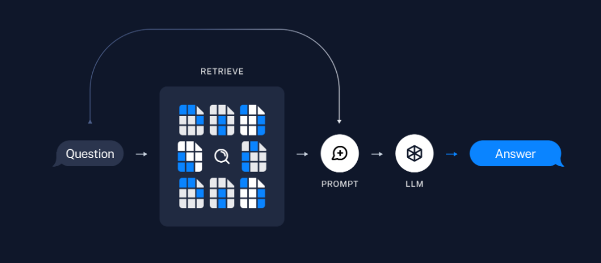

# RAG 챗봇 만들기

https://spri.kr/posts/view/23669
pdf 파일 - 인공지능 산업의 최신 동향

## RAG 기본 구조

### 1. 사전작업(Pre-Processing)

1. 문서 로드(Load) : 문서(pdf, word), RAW DATA, 웹페이지, Notion 등의 데이터 읽기
2. 분할(Split) : 불러온 문서를 chunk 단위로 분할
3. 임베딩(Embedding) : 문서를 벡터 표현으로 변환
4. 벡터 DB(VectorStore) : 변환된 벡터를 DB에 저장

### RAG 수행(RunTime)

5. 검색(Retrieval) : 유사도 검색(similarity, mmr), Multi-Query, Multi-Retriever
6. 프롬프트(Prompt) : 검색된 결과를 바탕으로 원하는 결과를 도출하기 위한 프롬프트
7. 모델(LLM) : 모델 선택(GPT-3.5, GPT-4, etc)
8. 결과(Output) : 텍스트, JSON, 마크다운
   

**1.py**

# 실습

## 프롬프트 개선해주는 프롬프트 메이커 적용하기

1. prompt files select box 만들기
2. task input ui 요소 추가
3. llm에 새로 로드한 프롬프트 전달
4. prompt-maker.yaml

```
-   task : 블로그 글 작성
-   question :
    당신은 NAVER 블로그 글 작성 전문가입니다. 당신의 임무는 전문적인 블로그 게시물을 작성하는 것입니다. "대한민국" 이라는 주제로 글을 작성해 주세요.
```

5. general.yaml
   출력된 프롬프트 입력

# 3. 페이지 분할 후 파일 업로드 기능 추가하기

## PDF 기반 QA 챗봇 만들기

**Pages/01-PDF0.py**

-   selected_prompt 작성
-   task_input 삭제
-   task 변수 삭제
-   파일 업로드 UI 추가
-   파일 캐시
    @st.cache_resource
    파일을 캐싱해주는 역할.
    같은 파일을 두세 번 업로드 하더라도 이미 업로드되어 처리된 파일을 캐싱된 값을 사용도록 만들어주는 데코레이션

    보통 캐싱하는 파일은 처리 시간이 오래 걸리므로 파일이 처리 중임을 나타내는 메시지와 스피너 UI 추가

-   캐시 디렉터리 생성

**Pages/01-PDF1.py**
embed_file

-   문서로드
-   문서 분할
-   임베딩
-   DB 생성
-   리트리버 생성
    create_chain
-   프롬프트 생성
-   언어 모델 생성
-   체인 생성

```python
retriever = embed_file(uploaded_file)
create_chain(retriever)
```

chain 변수가 사라지지 않도록 session_state에 저장
파일을 업로드한 상태가 되면 스트리밍 기록을 저장

chain이 None인 경우 파일을 업로드해달라는 경고 메시지 띄우기

사용자 입력을 체인이 생성되고 난 후로 옮기기

```
삼성전자가 개발한 생성형 AI의 이름은?
```

## LangSmith 추적, 다양한 LLM을 RAG에 적용

**Pages/01-PDF2.py**
create_chain에 model_name 추가

## 프롬프트에 출처 표시하고 표 기능 추가하기

**Pages/01-PDF3.py**
프롬프트 수정

# 배포

streamlit community cloud 사용
requirements.txt 또는 pyproject.toml에 필요한 패키지 기입 필요

1. https://streamlit.io/cloud
   접속 → GitHub 계정으로 로그인
2. “Create app” 버튼 클릭
3. GitHub repo / 브랜치 / 메인 파일 경로 선택
4. “Deploy” 클릭
